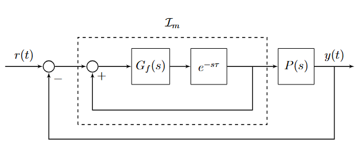

# RCController - Repetitive Control controller

## Overview

The `RCController` class implements a Repetitive Control (RC) controller.



## Constructor

```python
RCController(Tc: float, LPFilter: FirstOrderLowPassFilter, Delay: Delay)
```

### Parameters

- `Tc` (float): Sampling time (must be a positive scalar).
- `LPFilter` (FirstOrderLowPassFilter): A low pass filter ([see](first_order_low_pass_filter.md)).
- `Delay` (Delay): A delay filter ([see](delay.md)).

## Methods

### `initialize()`

Resets the internal state variables.

### `starting(reference: float, measure: float, u: float)`

Initializes the controller state based on the given input conditions.

### `compute_control_action(reference: float, y: float) -> float`

Computes the control action based on the error as difference between the reference and the y input.

## Example Usage

```python
from project_part_2 import RCController

# Create controller components
delay = Delay(Tc=0.01, L=0.5)
lp_filter = FirstOrderLowPassFilter(Tc=0.01, time_constant=1)

# Create the controller
rc_controller = RCController(Tc=0.01, LPFilter=lp_filter, Delay=delay)

# Initialize the controller
rc_controller.initialize()

# Start the controller
rc_controller.starting(reference=0, measure=0, u=0)

# Compute a control action
control_output = rc_controller.compute_control_action(reference=1.0, y=0.6)
print("Control Output:", control_output)
```

## License

This project is open-source and can be used freely for research and development purposes.
